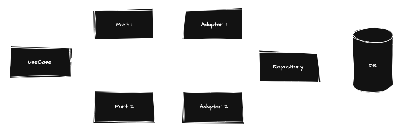

# Itaú Backend Challenge for Júnior Engineers (Job Vacancy 99)
By Gabriel Araújo

- Built in Java 21
- Built in SpringBoot 3.4.4

## Dependencies

- Maven 3.9.9
- Java 21
- Docker (optional)

## Challenge

- You can read about the challenge [here](./CHALLENGE.md) (PT-BR Language)

## Architecture

In this Challenge, I used Hexagonal Architecture with Domain Driven Design Pattern and Clean Architecture fundamentals. 

- UseCases and Ports are in Core Layer
- Adapters and Repository are in Adapters Layer
- Ports are contracts and Adapters are the implementation of Ports
- Repository sends to Adapter a TableEntity, Adapter map to CoreEntity and sends to UseCase
- UseCase only can see Port Contract
- External Classes only can see `executar` method from UseCase, but the real code are in `aplicarLogicaInterna`

## How Start the Application

- Download the source code
- Ensure that you have `Docker` and `Docker Compose` on your infrastructure
- In the root folder, run `docker compose up --build -d` or `docker-compose up --build -d`

## Development use

- Clone the repo
- Run `mvn clean package -DskipTests` to create a first build and download packages
- Start your favorite code editor
- Start application with `mvn spring-boot:run`

## Documentation

Swagger will be available in `/swagger-ui/index.html` route.